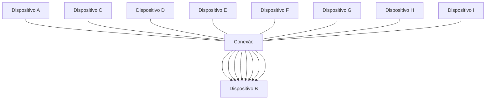
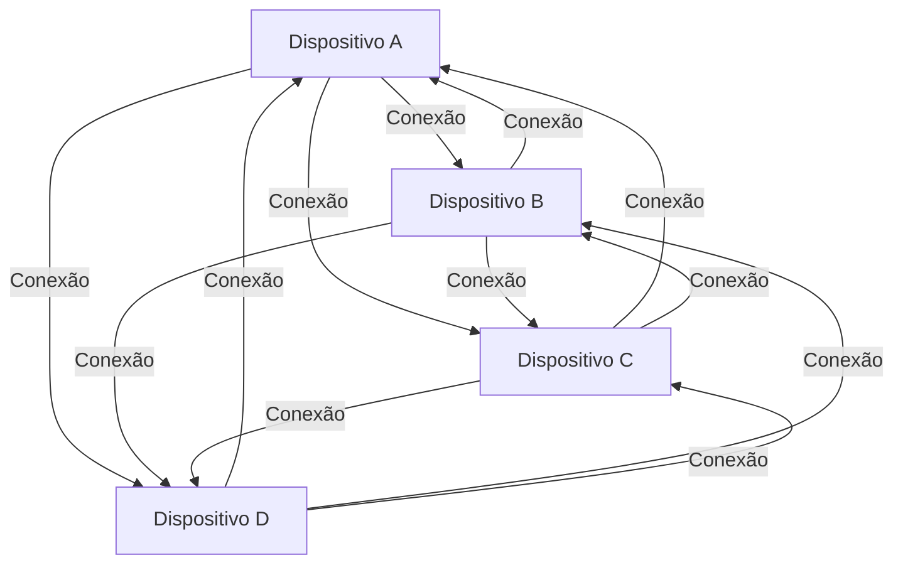

# 3 - Redes sem fio

A topologia de uma rede é representada pelo arranjo de ligação dos nós através dos enlaces. Essas ligações podem ocorrer das mais diversas formas, o que resulta em diferentes tipos de topologia.

Dois exemplos:

**Topologia de barramento:**




**Topologia parcialmente conectada ou distribuída:**

```Mermaid
graph TD
    A[Dispositivo A] -- Conexão --> B[Dispositivo B]
    A -- Conexão --> C[Dispositivo C]
    B -- Conexão --> C
    B -- Conexão --> D[Dispositivo D]
    C -- Conexão --> E[Dispositivo E]
    D -- Conexão --> E
    F[Dispositivo F] -- Conexão --> B
    F -- Conexão --> C
    G[Dispositivo G] -- Conexão --> C
    H[Dispositivo H] -- Conexão --> D
    I[Dispositivo I] -- Conexão --> D
    J[Dispositivo J] -- Conexão --> E

```

**Topologia Totalmente conectada Full Mesh:**




___

# Classificação da rede quanto à área de cobertura

`Rede PAN` - Redes pessoais.

`Rede LAN` - Local, Conjunto de pessoas que se conectarão ponto a ponto. Casa, empresa, etc.

___

# Meio de transmissão - Rede sem fio ou Rede Guiadas

* Rede guiadas - Utiliza cabos.
  * Cabo coaxial - Entrega banda alta, porém de difícil maleabilidade e instalção.
  * Par trançado - Mais comum, flexível.
  * Fibra ótica - Entrega a maior largura de banda, menos suscetível a interferência externa, porém são mais frágeis

* Rede sem fio
  * Infra vermelho - Frequência mais alta e tem que ser direcional.
  * Micro-ondas - Trabalha com ondas menores, apontando em linhas retas.
  * Rádio - Trabalha nas frequências mais baixas em todas as direções.